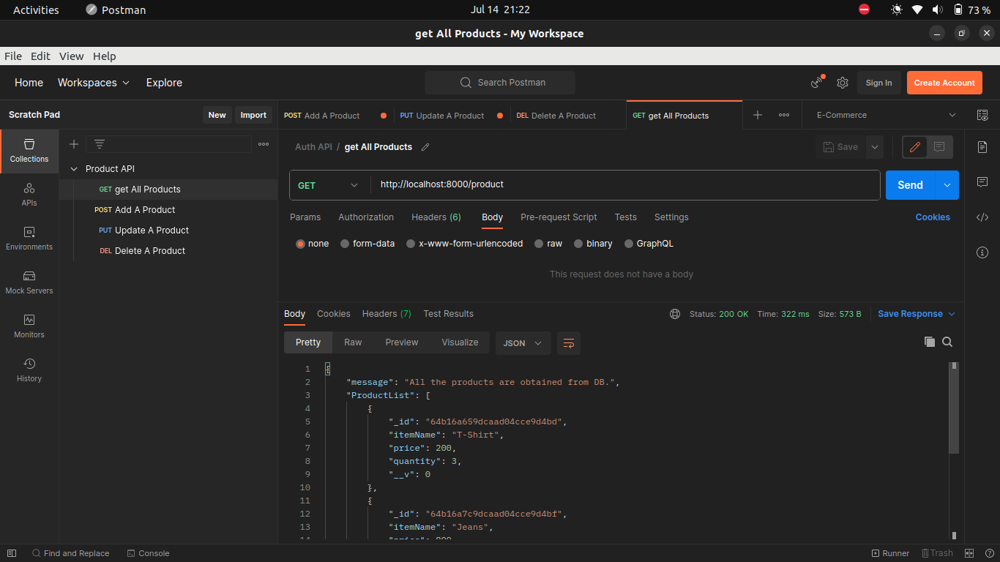
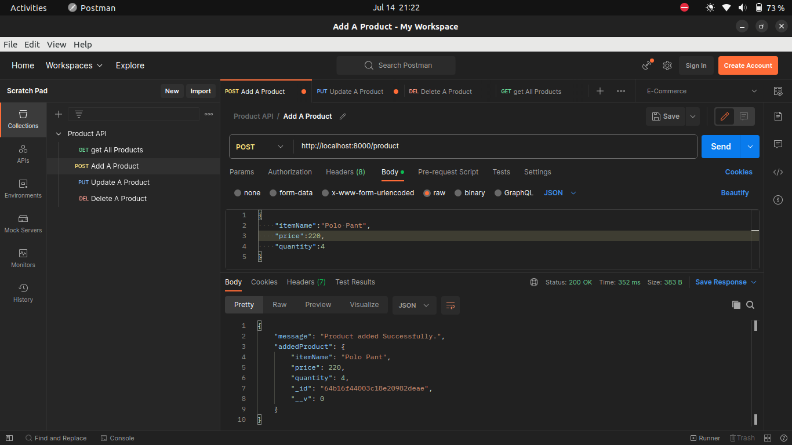
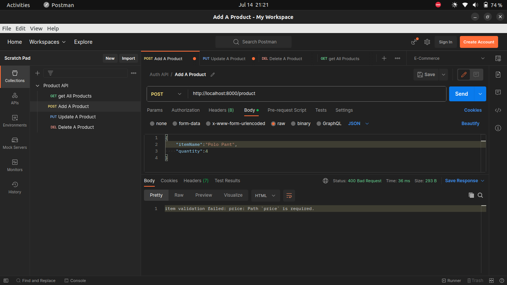
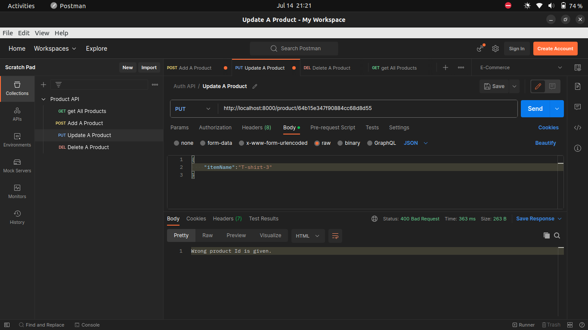
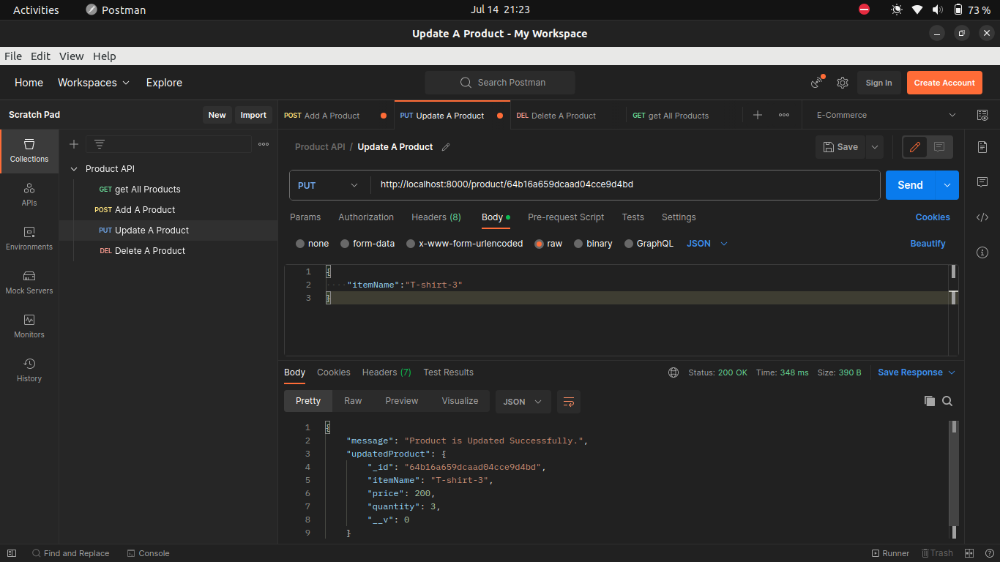
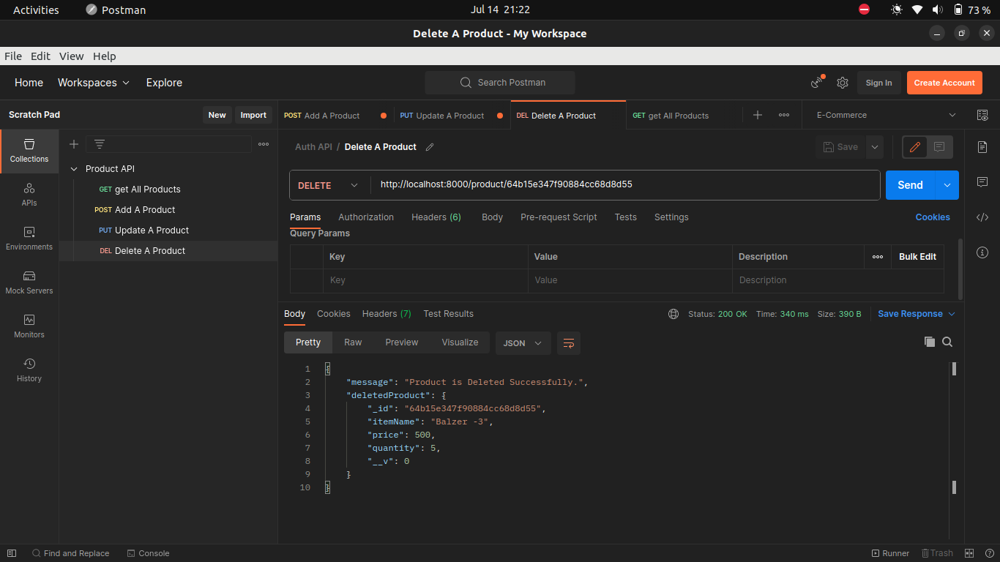

# CRUD Operation on "Products" with Security Features and proper Error Handling:-

## 1. Why did you choose your particular data structure to store products in the backend?

 I chosed to use a document-oriented data structure to store products for several reasons:

1. Flexibility: MongoDB allows for flexible schema design, which makes it easier to accommodate changes to the data structure over time. This is especially useful in e-commerce projects where product information may change frequently, and where new fields may need to be added to the product structure.
2. Performance: Document-oriented databases like MongoDB can provide better performance for certain types of queries, such as those that involve nested or complex data structures. In an e-commerce project, there may be a need to perform complex queries to retrieve products based on various criteria, such as category, price range, or brand.
3. Scalability: Document-oriented databases like MongoDB are designed to scale horizontally, which means that they can handle large amounts of data and high levels of traffic. This is important in e-commerce projects that may need to handle a large number of products and customers.
4. Integration with Node.js: MongoDB has a native driver for Node.js, which makes it easy to integrate with Node.js applications. This allows for seamless communication between the frontend and backend of the e-commerce application.
5. Community support: MongoDB has a large and active community of developers, which means that there are many resources available for learning and troubleshooting. This can be especially helpful in e-commerce projects where time is of the essence.

## 2. How did you handle error cases in your API?

There are 2 types of error I faced during the development.

i) Logical Error ⇒ I Solved the logical error by using debugger and some console.log 

ii) Operational Error ⇒ These error was scenario based, and to solve those error I put the code which could generate error in try block and received it in catch block when it caused error.

To make it more generic I created a middleware for error handling which receive the error and send the response according to the error message and no messy thing would be logged in the terminal of server.

## 3. What measures did you take to ensure your API is secure?

1.  Error handling: I implemented proper error handling to ensure that sensitive information will not exposed in error messages and that the API endpoints will not return unnecessary information.
2. Input validation: I  ensured that all input data to the API endpoints was validated to prevent attacks such as cross-site scripting (XSS).

## 4. If given more time, how would you improve this API?

1. I would use HTTPS for secure communication: HTTPS instead of HTTP to ensure that all communication between the client and server is encrypted and secure. We can obtain an SSL certificate from a trusted certificate authority (CA) to enable HTTPS for our application.
2. I would implement authentication and authorization:  authentication and authorization to ensure that only authorized users can access our application and its resources and would use secure password storage practices such as hashing and salting to protect user passwords.
3. I would validate the input data: Validate all input data to prevent attacks such as SQL injection, cross-site scripting (XSS), and command injection and would use input validation libraries and frameworks to simplify input validation.
4. I would use  rate limiting and throttling: rate limiting and throttling to prevent brute-force attacks and other types of attacks that involve excessive requests to our application.

## 5. What was your approach to testing the API endpoints?

1. Test each API endpoint individually: I tested each API endpoint individually using Postman and by manually sending HTTP requests to the endpoint. I verified that the endpoint returns the correct response and that the response contains the expected data.
2. Test different scenarios: I tested the API endpoints for different scenarios, such as creating a new product, updating an existing product, retrieving a list of products, and deleting a product. I also  tested for error scenarios, such as sending invalid input data or trying to access a resource that doesn't exist.
3. Test the data in the database: I manually checked the data in the MongoDB database to verify that the API endpoints were correctly adding, updating, and deleting data from the database.

## Screenshot of Outcome:-
1. Get All Products:

2. Add A Product:

3.Add A Product:(handling Error):

4. Update A Product:

5. Update A Product:(handling Error):

6.Delete A Product:

